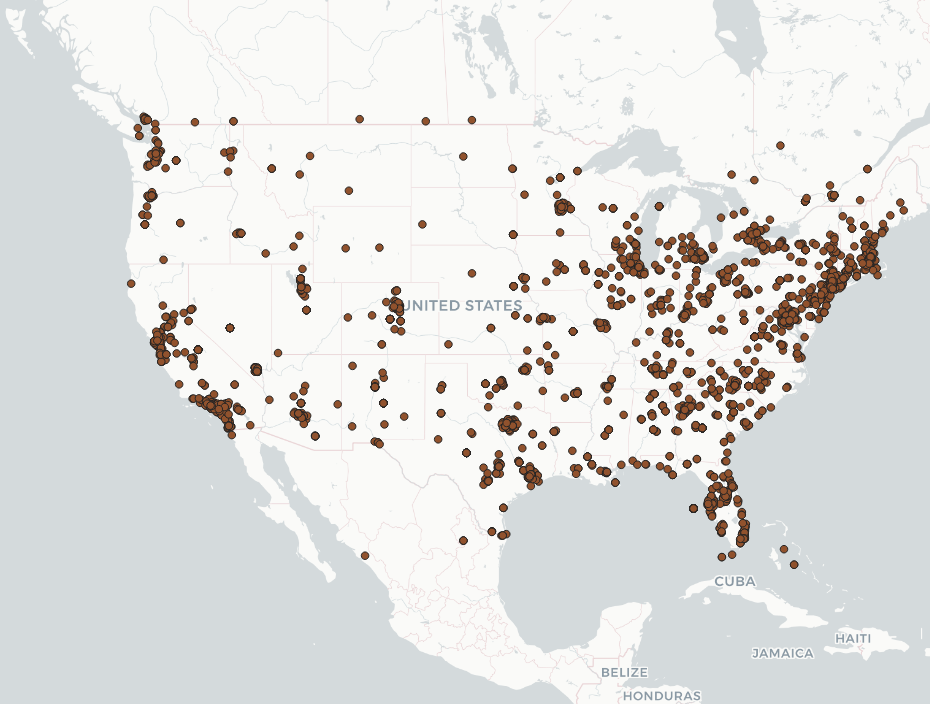
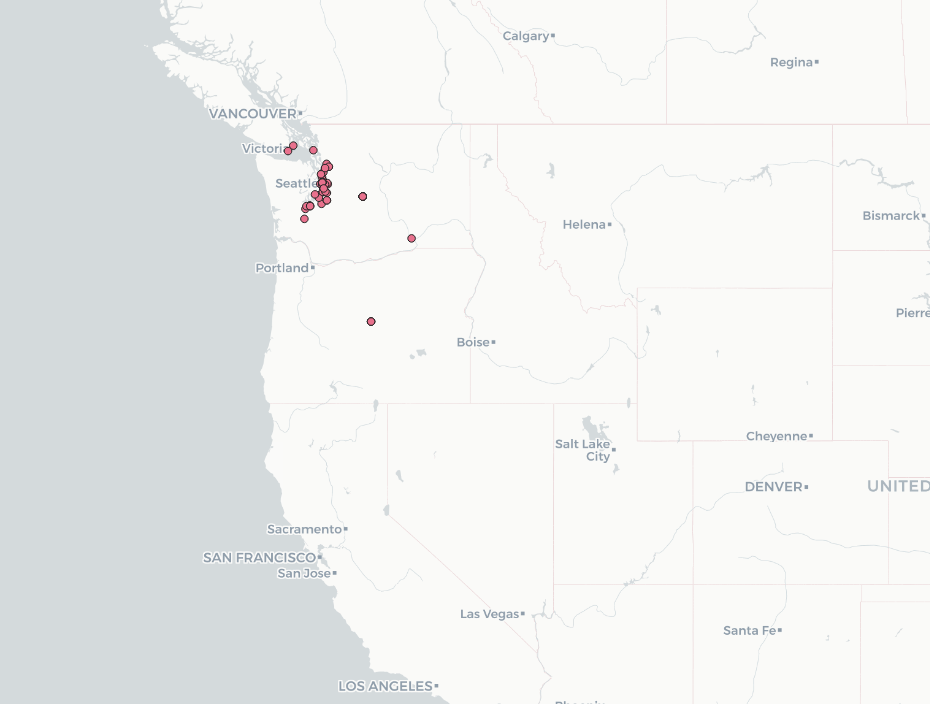
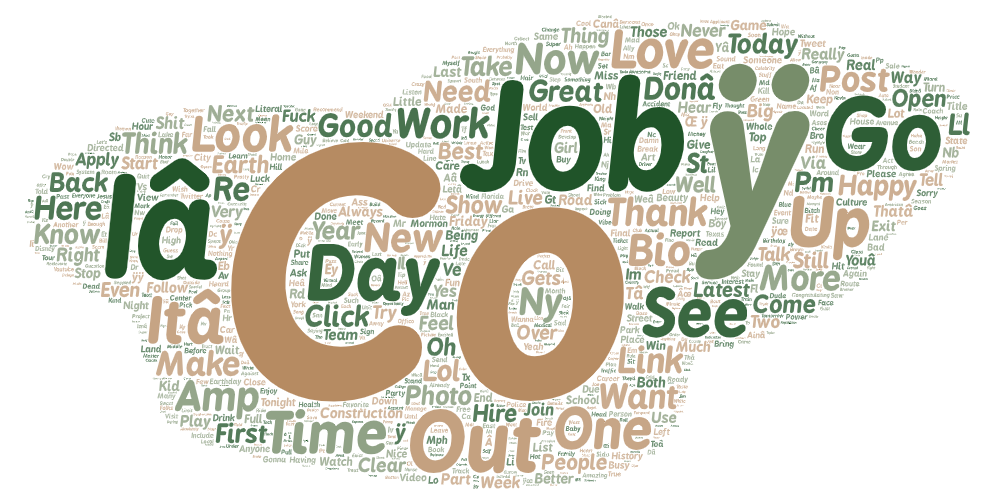
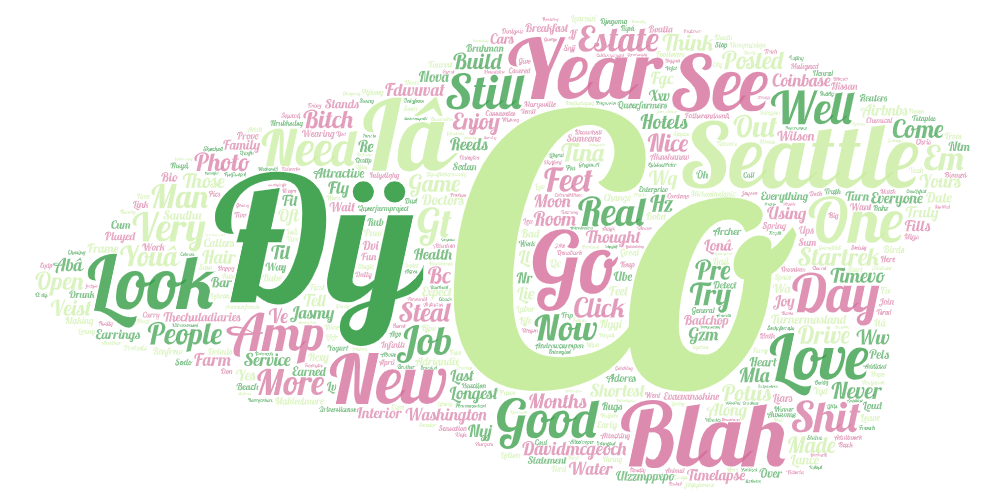

# GEOG465_Lab2
1. The reason I chose to compare the United States and Washington was because even though Washington is within the United States I wanted to observe if there were any words that would be unique to Washington in comparison to the whole United States.
2. 
USA

Washington

The reason why these differ is because they are different regions, while part of Washington tweets are incorporated into the United States tweets, we get a deeper dive into culture and language used within the Washington region. We can also observe that for Washington tweets majority of them come from big city areas such as Seattle and Bellevue and not much in the surrounding small communities.

3.
USA WordCloud

Washington WordCloud

One thing that we can observe is that "Co" is a very big word found in both word clouds, I am not entirely sure the context which is was being used but I think that was an interesting finding. Seattle is also a word that is frequently found in the Washington word cloud which makes sense as its a big city and pretty popular. One thing i saw in the USA word cloud that was unique was that it had a few words that dealt with jobs such as "Hire", "Job" and "Work". While this was not really found in the Washington word cloud it brings up an interesting topic that might be more relevant through the rest of the United States.